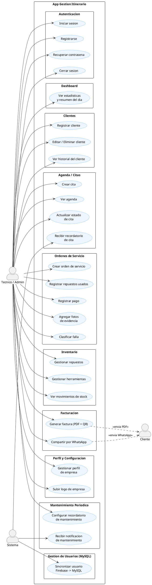

# Documentación de Requerimientos
## App Gestión de Itinerario — Soluciones

---

## 1. Diagrama de Casos de Uso (PlantUML)

Pegar en https://www.plantuml.com/plantuml/uml/ para visualizar.

---

## 2. Requerimientos Funcionales

| ID    | Descripción | Actor | Prioridad |
|-------|-------------|-------|-----------|
| RF-01 | El sistema debe permitir al usuario crear una cuenta mediante correo electrónico y contraseña. | Técnico/Admin | Alta |
| RF-02 | El sistema debe permitir iniciar sesión con credenciales registradas. | Técnico/Admin | Alta |
| RF-03 | El sistema debe permitir recuperar la contraseña mediante el envío de un correo electrónico. | Técnico/Admin | Alta |
| RF-04 | El sistema debe sincronizar automáticamente los datos del usuario autenticado con la base de datos MySQL al momento del inicio de sesión o registro. | Sistema | Alta |
| RF-05 | El sistema debe mostrar un panel de control (dashboard) con estadísticas de citas pendientes, órdenes en curso, cobros del mes y un saludo personalizado. | Técnico/Admin | Alta |
| RF-06 | El sistema debe permitir registrar, editar y eliminar clientes con datos de contacto. | Técnico/Admin | Alta |
| RF-07 | El sistema debe mostrar el historial completo de servicios realizados por cliente. | Técnico/Admin | Alta |
| RF-08 | El sistema debe permitir crear y gestionar citas en una agenda con fecha, hora, cliente y descripción. | Técnico/Admin | Alta |
| RF-09 | El sistema debe enviar notificaciones push como recordatorio de citas programadas. | Sistema | Alta |
| RF-10 | El sistema debe permitir registrar equipos o dispositivos asociados a un cliente. | Técnico/Admin | Alta |
| RF-11 | El sistema debe permitir crear órdenes de servicio vinculadas a un cliente y equipo. | Técnico/Admin | Alta |
| RF-12 | El sistema debe permitir registrar los repuestos utilizados dentro de cada orden de servicio. | Técnico/Admin | Alta |
| RF-13 | El sistema debe permitir registrar pagos parciales o totales de una orden de servicio. | Técnico/Admin | Alta |
| RF-14 | El sistema debe permitir adjuntar fotografías de evidencia a una orden de servicio. | Técnico/Admin | Media |
| RF-15 | El sistema debe permitir clasificar el tipo de falla reportada en una orden de servicio. | Técnico/Admin | Media |
| RF-16 | El sistema debe gestionar el inventario de repuestos y herramientas con control de stock. | Técnico/Admin | Alta |
| RF-17 | El sistema debe registrar automáticamente los movimientos de entrada y salida del inventario. | Sistema | Media |
| RF-18 | El sistema debe generar facturas en formato PDF con código QR. | Técnico/Admin | Alta |
| RF-19 | El sistema debe permitir compartir facturas directamente por WhatsApp. | Técnico/Admin | Alta |
| RF-20 | El sistema debe permitir configurar recordatorios de mantenimiento periódico (semanal/mensual) por equipo. | Técnico/Admin | Media |
| RF-21 | El sistema debe enviar notificaciones push cuando un recordatorio de mantenimiento esté próximo a vencer. | Sistema | Media |
| RF-22 | El sistema debe permitir gestionar el perfil de la empresa, incluyendo nombre, dirección y logo. | Técnico/Admin | Media |

---

## 3. Requerimientos No Funcionales

| ID     | Descripción | Categoría | Prioridad |
|--------|-------------|-----------|-----------|
| RNF-01 | El sistema debe responder a las interacciones del usuario en un tiempo máximo de 3 segundos bajo condiciones normales de conectividad. | Rendimiento | Alta |
| RNF-02 | La aplicación debe ser compatible con dispositivos Android versión 8.0 (API nivel 26) o superior. | Compatibilidad | Alta |
| RNF-03 | Toda la autenticación de usuarios debe gestionarse a través de Firebase Authentication, garantizando el cifrado de credenciales en tránsito mediante HTTPS. | Seguridad | Alta |
| RNF-04 | La API REST PHP debe validar y sanitizar todos los parámetros de entrada para prevenir inyección SQL y otros ataques de tipo OWASP. | Seguridad | Alta |
| RNF-05 | La interfaz de usuario debe seguir las directrices de Material Design 3 y ser funcional en pantallas desde 5 pulgadas de diagonal. | Usabilidad | Alta |
| RNF-06 | El sistema debe conservar la sesión del usuario activa entre reinicios de la aplicación. | Disponibilidad | Alta |
| RNF-07 | Las funcionalidades de consulta de clientes, agenda e inventario deben operar en modo sin conexión a través del caché local de Firebase Firestore. | Disponibilidad | Media |
| RNF-08 | El código fuente debe estar organizado bajo la arquitectura MVVM, con separación de capas (UI, dominio, datos) e inyección de dependencias mediante Hilt. | Mantenibilidad | Alta |
| RNF-09 | La base de datos MySQL debe estar diseñada y normalizada hasta la Tercera Forma Normal (3FN). | Mantenibilidad | Media |
| RNF-10 | Los archivos PDF generados por el sistema no deben superar los 5 MB de tamaño. | Rendimiento | Media |
| RNF-11 | El sistema debe proteger los datos personales de los clientes conforme a principios básicos de privacidad, evitando exponer información sensible en logs o respuestas de API. | Seguridad | Alta |
| RNF-12 | La aplicación debe mostrar mensajes de error comprensibles al usuario ante fallos de red, autenticación o validación de datos. | Usabilidad | Media |
